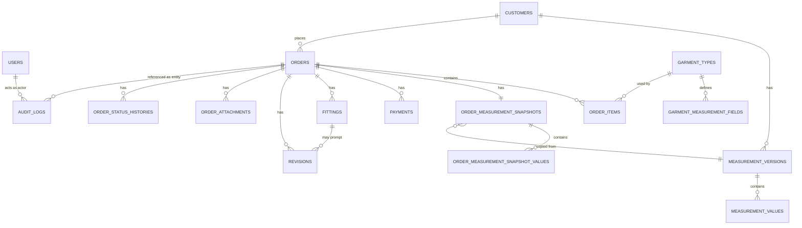

# JahitFlow — Database Design (ERD)

Notation: `PK` primary key, `FK` foreign key, `UQ` unique, `IDX` indexed. All tables have `created_at TIMESTAMPTZ DEFAULT now()` unless noted; mutable tables also have `updated_at TIMESTAMPTZ`. All PKs are `UUID DEFAULT gen_random_uuid()` (see `DECISIONS.md#D-011`).

## Mermaid Overview

## Table Definitions

### users
| Field | Type | Notes |
|---|---|---|
| id | UUID PK | |
| name | TEXT | |
| phone | TEXT | nullable |
| role | TEXT | enum-like, default `owner`; not enforced via app auth yet |
| is_active | BOOLEAN | default true |
| created_at | TIMESTAMPTZ | |

### customers
| Field | Type | Notes |
|---|---|---|
| id | UUID PK | |
| name | TEXT NOT NULL | IDX (for search) |
| phone | TEXT | IDX (for search), normalized form also stored or derived at query time |
| email | TEXT | nullable |
| address | TEXT | nullable |
| notes | TEXT | nullable |
| created_at | TIMESTAMPTZ | |
| updated_at | TIMESTAMPTZ | |
| deleted_at | TIMESTAMPTZ | nullable; soft delete |

### measurement_versions
| Field | Type | Notes |
|---|---|---|
| id | UUID PK | |
| customer_id | UUID FK → customers.id | IDX |
| version_number | INTEGER NOT NULL | sequential per customer, computed at insert |
| label | TEXT | nullable, e.g. "Initial", "Post-diet correction" |
| notes | TEXT | nullable |
| measured_at | TIMESTAMPTZ NOT NULL | when the measurement was actually taken |
| created_by | UUID FK → users.id | nullable |
| created_at | TIMESTAMPTZ | insertion time |

No `updated_at`, no `deleted_at` — immutable, never edited or removed (`DECISIONS.md#D-008`). UNIQUE(`customer_id`, `version_number`).

### measurement_values
| Field | Type | Notes |
|---|---|---|
| id | UUID PK | |
| measurement_version_id | UUID FK → measurement_versions.id | IDX |
| field_key | TEXT NOT NULL | e.g. `chest`, `waist`, `shoulder` |
| value | DECIMAL(6,2) NOT NULL | |
| unit | TEXT NOT NULL | e.g. `cm` |

UNIQUE(`measurement_version_id`, `field_key`).

### garment_types
| Field | Type | Notes |
|---|---|---|
| id | UUID PK | |
| name | TEXT NOT NULL UQ | |
| description | TEXT | nullable |
| is_active | BOOLEAN | default true |
| created_at | TIMESTAMPTZ | |
| updated_at | TIMESTAMPTZ | |
| deleted_at | TIMESTAMPTZ | nullable |

### garment_measurement_fields
| Field | Type | Notes |
|---|---|---|
| id | UUID PK | |
| garment_type_id | UUID FK → garment_types.id | IDX |
| field_key | TEXT NOT NULL | matches `measurement_values.field_key` vocabulary |
| label | TEXT NOT NULL | display label, e.g. "Lingkar Dada" |
| unit | TEXT NOT NULL | |
| is_required | BOOLEAN | default true |
| sort_order | INTEGER | default 0 |

UNIQUE(`garment_type_id`, `field_key`).

### order_number_counters
| Field | Type | Notes |
|---|---|---|
| year | INTEGER PK | |
| last_value | INTEGER NOT NULL | incremented with row lock on order creation |

### orders
| Field | Type | Notes |
|---|---|---|
| id | UUID PK | |
| order_number | TEXT NOT NULL UQ | e.g. `JF-2026-001` |
| customer_id | UUID FK → customers.id | IDX |
| status | TEXT NOT NULL | enum: see `STATE-MACHINES.md` |
| requires_fitting | BOOLEAN | default true |
| order_date | TIMESTAMPTZ NOT NULL | default now() |
| deadline_at | TIMESTAMPTZ NOT NULL | IDX (for dashboard/calendar due queries) |
| subtotal | DECIMAL(14,2) NOT NULL | sum of order_items subtotals |
| additional_cost | DECIMAL(14,2) | default 0 |
| express_fee | DECIMAL(14,2) | default 0 |
| discount | DECIMAL(14,2) | default 0 |
| total | DECIMAL(14,2) NOT NULL | `subtotal + additional_cost + express_fee - discount` |
| paid_total_cache | DECIMAL(14,2) | denormalized, recomputed on payment write |
| payment_status_cache | TEXT | denormalized: `UNPAID`/`PARTIAL`/`PAID` |
| notes | TEXT | nullable |
| cancelled_at | TIMESTAMPTZ | nullable |
| cancellation_reason | TEXT | nullable |
| created_at | TIMESTAMPTZ | |
| updated_at | TIMESTAMPTZ | |

No `deleted_at` — cancellation is the deletion equivalent (`DECISIONS.md#D-008`).

### order_items
| Field | Type | Notes |
|---|---|---|
| id | UUID PK | |
| order_id | UUID FK → orders.id | IDX |
| garment_type_id | UUID FK → garment_types.id | |
| quantity | INTEGER NOT NULL | > 0 |
| unit_price | DECIMAL(14,2) NOT NULL | |
| subtotal | DECIMAL(14,2) NOT NULL | `quantity * unit_price` |
| notes | TEXT | nullable |

### order_measurement_snapshots
| Field | Type | Notes |
|---|---|---|
| id | UUID PK | |
| order_id | UUID FK → orders.id UQ | one-to-one; UNIQUE ensures a single active snapshot |
| source_measurement_version_id | UUID FK → measurement_versions.id | traceability only |
| created_at | TIMESTAMPTZ | |
| superseded_by_resnapshot_at | TIMESTAMPTZ | nullable; set if a resnapshot action replaced this (see below) |

Note: because resnapshotting (per `BUSINESS-RULES.md#measurement`) must preserve history, a resnapshot does **not** update this row in place — it inserts a **new** `order_measurement_snapshots` row and marks the old one's `superseded_by_resnapshot_at`. The order's "current" snapshot is the one with `superseded_by_resnapshot_at IS NULL`. The UNIQUE constraint above is therefore a **partial unique index** (`UNIQUE (order_id) WHERE superseded_by_resnapshot_at IS NULL`).

### order_measurement_snapshot_values
| Field | Type | Notes |
|---|---|---|
| id | UUID PK | |
| order_measurement_snapshot_id | UUID FK → order_measurement_snapshots.id | IDX |
| field_key | TEXT NOT NULL | |
| value | DECIMAL(6,2) NOT NULL | |
| unit | TEXT NOT NULL | |

UNIQUE(`order_measurement_snapshot_id`, `field_key`).

### order_status_histories
| Field | Type | Notes |
|---|---|---|
| id | UUID PK | |
| order_id | UUID FK → orders.id | IDX |
| from_status | TEXT | nullable (initial creation) |
| to_status | TEXT NOT NULL | |
| changed_by | UUID FK → users.id | nullable |
| reason | TEXT | nullable |
| changed_at | TIMESTAMPTZ | default now() |

Append-only, no updates/deletes.

### payments
| Field | Type | Notes |
|---|---|---|
| id | UUID PK | |
| order_id | UUID FK → orders.id | IDX |
| type | TEXT NOT NULL | enum: `DP`, `PARTIAL`, `FINAL`, `ADJUSTMENT` |
| amount | DECIMAL(14,2) NOT NULL | may be negative only if `type=ADJUSTMENT` |
| method | TEXT | nullable, e.g. `cash`, `transfer` |
| note | TEXT | required if `type=ADJUSTMENT` |
| reversed_payment_id | UUID FK → payments.id | nullable |
| recorded_by | UUID FK → users.id | nullable |
| recorded_at | TIMESTAMPTZ | default now() |

Append-only, no updates/deletes.

### fittings
| Field | Type | Notes |
|---|---|---|
| id | UUID PK | |
| order_id | UUID FK → orders.id | IDX |
| fitting_number | INTEGER NOT NULL | sequential per order |
| status | TEXT NOT NULL | `SCHEDULED`/`DONE`/`CANCELLED` |
| scheduled_at | TIMESTAMPTZ | nullable |
| occurred_at | TIMESTAMPTZ | nullable, set when `DONE` |
| result | TEXT | nullable until `DONE`: `APPROVED`/`NEEDS_REVISION` |
| notes | TEXT | nullable |
| next_action | TEXT | nullable |
| created_at | TIMESTAMPTZ | |
| updated_at | TIMESTAMPTZ | |

UNIQUE(`order_id`, `fitting_number`). No hard delete; use `CANCELLED` status.

### revisions
| Field | Type | Notes |
|---|---|---|
| id | UUID PK | |
| order_id | UUID FK → orders.id | IDX |
| fitting_id | UUID FK → fittings.id | nullable |
| issue | TEXT NOT NULL | |
| requested_change | TEXT | nullable |
| status | TEXT NOT NULL | `OPEN`/`IN_PROGRESS`/`RESOLVED`/`CANCELLED` |
| notes | TEXT | nullable |
| resolved_at | TIMESTAMPTZ | nullable |
| created_at | TIMESTAMPTZ | |
| updated_at | TIMESTAMPTZ | |

No hard delete; use `CANCELLED` status.

### order_attachments
| Field | Type | Notes |
|---|---|---|
| id | UUID PK | |
| order_id | UUID FK → orders.id | IDX |
| type | TEXT NOT NULL | `CUSTOMER_REFERENCE`/`GARMENT_REFERENCE`/`RESULT`/`OTHER` |
| cloudinary_public_id | TEXT NOT NULL | |
| secure_url | TEXT NOT NULL | |
| format | TEXT | nullable |
| width | INTEGER | nullable |
| height | INTEGER | nullable |
| uploaded_by | UUID FK → users.id | nullable |
| uploaded_at | TIMESTAMPTZ | |
| deleted_at | TIMESTAMPTZ | nullable; soft delete |

### audit_logs
| Field | Type | Notes |
|---|---|---|
| id | UUID PK | |
| actor_id | UUID FK → users.id | nullable |
| entity_type | TEXT NOT NULL | IDX, e.g. `order`, `payment` |
| entity_id | UUID NOT NULL | IDX |
| action | TEXT NOT NULL | e.g. `create`, `status_change`, `resolve` |
| before | JSONB | nullable |
| after | JSONB | nullable |
| created_at | TIMESTAMPTZ | IDX |

Append-only.

## Indexing Summary

- `customers(name)`, `customers(phone)` — search.
- `orders(order_number)` UNIQUE, `orders(customer_id)`, `orders(deadline_at)`, `orders(status)` — dashboard/calendar/search.
- `payments(order_id)`, `fittings(order_id)`, `revisions(order_id)`, `order_attachments(order_id)`, `order_status_histories(order_id)` — detail page loads.
- `audit_logs(entity_type, entity_id)`, `audit_logs(created_at)` — investigation queries.

## Referential Integrity

All FK relationships use `ON DELETE RESTRICT` by default (nothing in this domain is hard-deleted in a way that should cascade), except:
- `measurement_values.measurement_version_id`, `order_measurement_snapshot_values.order_measurement_snapshot_id`, `order_items.order_id`, `garment_measurement_fields.garment_type_id` use `ON DELETE CASCADE` **only in the sense that** their parent is never actually deleted in application flow — cascade is set defensively for referential cleanliness, not because deletion is an expected path.
